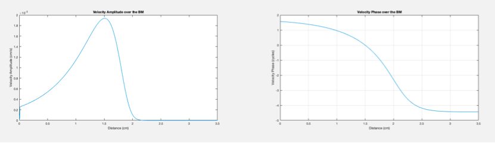

# cochlea-traveling-wave
 \
Within the scala media compartment of the human cochlea resides the organ of Corti. This sensory tissue contains various microstructures, namely the outer and inner hair cells, which act to amplify sound and transduce sound energy, respectively. Driven by the motion of the stapes bone, the 'traveling wave' is the interaction between the mass of the cochlear fluid and the stiffness of the organ of Corti. The interaction is referred to as 'tonotopic tuning'- as the stimulus frequency decreases, the peak of the response shifts further towards the apex of the cochlea. This script models the basic behavior of tonotopic tuning as seen in *in vivo* studies of the human cochlea.

## Requirements
* MATLAB 

## Pipeline
#### 1. Set parameters 
  * In every simulation, the maximal heat produced during reaches an equilibrium. However, the heat traces in the second experiment (varied shortening loads) require varied times to reach equilibrium.
  * The Parameter Controls section defines the conditions necessary for creating a pure-tone sinusoidal stimulus as well as the physical characteristics guiding the response of the basilar membrane (BM) motion, namely ρ, the density of the cochlear fluid; m, the unit mass of the BM; s, the unit stiffness of the BM; and r, the unit resistance of the BM (obtained experimentally). When the entire program is run, the first line of the Parameters Control section asks the user for the desired frequency to simulate. The range of frequencies for normal human speech is approximately 2000-4000 Hz. Therefore, 2000 Hz and 4000 Hz were used to create the included plots.

#### 2. Perform mechanical response calculations
  * The Response Calculations section outlines the physical relationships underlying the
various actors involved in the system. In order, calculations are performed for mechanical impedance Z, mechanical admittance Y, pressure P, velocity V, and displacement X.
  * 
  * The real and imaginary for each physical component were calculated, denoted by subscript r and i, respectively. The amplitude and phase for each physical component was also calculated, denoted by a subscript a and p, respectively. The matlab functions abs, angle, real, and imag were used to calculate the amplitude, phase, real part, and imaginary part, respectively, for Z and Y. For P, V, and X, however, the amplitude and phase equations are derived mathematically.
  * 
  * Equation 7 features division by 2𝛑; this operation is performed to unwrap the phase into cycles. Equation 11 calculates the phase of displacement based on that of velocity using the known relationship between the phase of sin and cos waves, which is +𝛑/2.

#### 3. Plot characteristic curves
  * The Plots section of the code displays the amplitude, phase, and waveform plots of each physical component of the tonotopic tuning curve. The plots for displacement feature a conversion from centimeter scale to nanometer scale, as denoted by the conversion factor of 1e7 in Equations 5 and 10. 

#### 3a. Local resonance
  * To find the local resonance of a point on the organ of Corti, a trial and error approach was taken to find the optimal m value for the desired local resonance.
  * 
  * The velocity response has a local resonance at x = 1.5 cm when the value of m is 0.015 g/cm2.

#### 3b. Stimulus enhancement
  * Stimulus enhancement was simulated by first finding the maximum amplitude of the displacement curve and then gradually decreasing the resistance over a region spanning ~19 mm centered around the point of resonance, referred to as the “amplification zone”.
  *  The real and imaginary parts of the mechanical impedance with stimulus enhancement enabled. At around x = 1.5 cm, there is a visible dip in the impedance that spans approximately 19mm. Also, the point at which the imaginary part crosses the x-axis is much later (almost at the apex at x = 3.227 cm) compared to all previous simulations.
  *  The velocity response with stimulus enhancement enabled. There is a visible increase in magnitude in all three plots, especially in that of the waveform. This signal enhancement is a result of the stimulus enhancement and occurs at the point of resonance of the original curve.
  *  The pressure response with stimulus enhancement enabled. In the pressure plots, there is only a visible increase in magnitude on the amplitude response. This is possibly due to the fact that the enhancement occurs locally at the organ of Corti and is not as apparent holistically when viewed from the pressure changes in the cochlear fluids.

#### 3c. Cochlear implant
  * The cochlear implant simulation was achieved by increasing the effective stiffness of the BM over a short distance starting at the base of the cochlea. The STANDARD and FLEXSOFT electrode arrays from MED-EL are 31.5 mm in length [[1]](https://doi.org/10.1016/j.heares.2017.10.005). In my implementation, a “short” electrode array was simulated resulting in a stiffness increase over a span of approximately 10mm, about one third of the length of the MED-EL electrode array.
  *  The real and imaginary parts of the mechanical impedance in the presence of the simulated implant. At the start of the plot there is a very sharp increase in the magnitude of the imaginary component while the real component remains near zero until very close to the apex.
  *  The amplitude and phase of the velocity response in the presence of the simulated implant. At the start of the plot there is a sharp increase in the magnitude of the velocity amplitude.
  *  The amplitude and phase of the pressure response in the presence of the simulated implant. The pressure amplitude and phase seem relatively unchanged by the presence of the implant.

#### 3d. Mass Dominance
  * Of special note is the last code block plotting mechanical impedance. When stiffness gets so small that mω > s/ω, the mechanics of the organ of Corti become dominated by mass rather than stiffness and so a wave will not propagate across the tissue. Therefore, the results when mω > s/ω are deemed meaningless and are thus not considered. In my program, I use a for loop to find where the imaginary part of the mechanical impedance (Zi) crosses the x-axis and automatically draw a line with the point of crossing as a label, denoting that the results to the right of the line represent a region of mass dominance and should thus be ignored.
  * 

## Performance:
  * The results presented show a variety of ways in which to simulate the function of the
cochlea, from tonotopic tuning to cochlear amplification. In my implementation, there are a few key observations to be made. Firstly, in simulating the displacement response of the BM, I converted the scale from cm to nm by scaling the vector by a factor of 1e7. However, this led to an unexpected magnitude of displacement values at around 108.
In simulating the cochlear mechanics with modified physical parameters, it was interesting to see how individual conditions change the curves. The sustained response when the mass of the BM was set to zero was particularly surprising. While finding the local resonance point where m⍵ = s/⍵, a scaling relationship of about 1/100x was found between the location of the velocity’s local resonance (x = 1.5 cm) with respect to the value of m (0.015 g/cm2). Further experiments would confirm whether this is a relevant phenomenon for modeling the characteristics of the human cochlea.\
Simulating the cochlear amplification was achieved by setting the resistance to be negative only over a small region, referred to as the amplification zone, centered around the BM location corresponding to the resonance point for the stimulus frequency in question. The enhancement effect was produced programmatically and successfully amplified the signal as intended, raising the velocity amplitude from 2.4337e8 nm/s to 2.6373e8 nm/s. Interestingly, the stimulus enhancement shifted the index of the peak by three to the right, approximately 10.5mm. I believe this is because with less stiffness, the BM oscillates to a greater extent and energy travels further down the tissue.\
To simulate the presence of the cochlear implant, I increased the effective stimulus for the first 10.5mm of the cochlear base. This resulted in a slight shift of the velocity peak toward the base. Furthermore, analysis of the mean difference in impedance over the length of the implant shows a reduction in the imaginary component by -5.7885e+04i g/(s-cm2) and no change in the real component.\
The overall performance of my implementation is successful in modeling the proposed experiments and demonstrates the capabilities of using software like MATLAB to explore the physical properties of biological systems such as the human cochlea.

## Extra example plots
####  * The model is useful in visualizing the characteristics of tonotopic tuning from different perspectives. By creating a pure tone stimulus of 4000 Hz, we can visualize the pressure response, velocity response, and displacement response over the BM.
  * Pressure Response 
  * Velocity Response 
  * Displacement Response 
  * The most apparent contrasts between the graphs of pressure, velocity, and displacement are in the amplitude responses and phase responses. The amplitude of the pressure decreases rapidly from a maximum value whereas amplitude of the velocity and displacement first increase gradually to a maximum value, and then drop steeply. The phase of the velocity leads that of the displacement by +𝛑/2.

####  * The characteristics of tonotopic tuning can be better understood by giving the model pure tone stimuluses of different frequencies as input.
  * 600 Hz 
  * 2000 Hz 
  * 6000 Hz 
  * One striking difference between the amplitude responses is the long distance that the wave travels before reaching its maximum amplitude at approximately x = 2.2 cm. This is in stark contrast to the 6000 Hz stimulus (which peaks at around x = 0.8 cm) because the mechanics of the BM dictate that a stimulus of a higher frequency will result in a peak closer to the base of the cochlea.

####  * Furthermore, we can modify the parameters of the BM mechanical impedance to explore the relationship between an auditory stimulus and the organ of Corti. A pure tone stimulus of 2000 Hz is used to visualize the velocity response with the following modifications:
  * BM mass equal to zero 
  * BM resistance * 1/10 
  * BM stiffness * 10 
  * With a stimulus frequency of 2000 Hz, there are quite a few differences between the plots modifying m, r, and s respectively. Firstly, it is apparent that a wave is able to propagate across the BM even if it is massless. This is unexpected and may indicate that the stiffness and resistance of the BM are sufficient to support a tuned response. This may not be surprising, however, as the structures in the cochlea are close to massless by design and could impair hearing otherwise. The response when resistance is decreased by a factor of 10 shows an earlier peak (emulating the response of a higher frequency) and oscillates more. The response when stiffness is increased by a factor of 10, however, shows a later peak with fewer oscillations, a contrast to the previous modification.

## Acknowledgements
* Fowler Memorial Laboratory, Biomedical Engineering Department, School of Engineering and Applied Science, Columbia University, New York, NY
